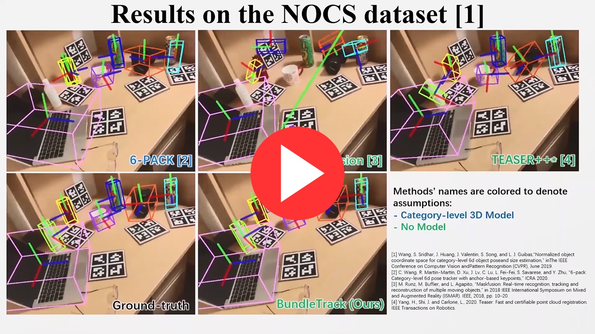
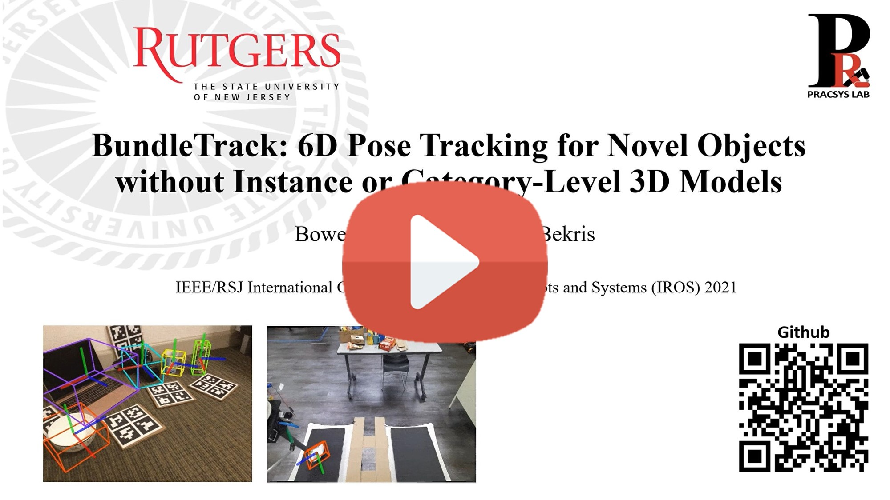
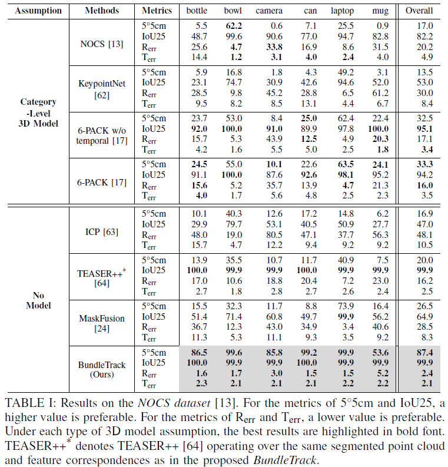
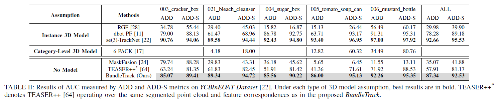

This is the official implementation of our paper:

[BundleTrack: 6D Pose Tracking for Novel Objects without Instance or Category-Level 3D Models](https://arxiv.org/abs/2108.00516)

 accepted in International Conference on Intelligent Robots and Systems (IROS) 2021.

# Abstract
Most prior 6D object pose tracking often assume that the target object's CAD model, at least at a category-level, is available for offline training or during online template matching. This work proposes BundleTrack, a general framework for 6D pose tracking of novel objects, which does not depend upon 3D models, either at the instance or category-level. It leverages the complementary attributes of recent advances in deep learning for segmentation and robust feature extraction, as well as memory-augmented pose graph optimization for spatiotemporal consistency. This enables long-term, low-drift tracking under various challenging scenarios, including significant occlusions and object motions.  Comprehensive experiments given two public benchmarks demonstrate that the proposed approach significantly outperforms state-of-art, category-level 6D tracking or dynamic SLAM methods. When compared against state-of-art methods that rely on an object instance CAD model, comparable performance is achieved, despite the proposed method's reduced information requirements. An efficient implementation in CUDA provides a real-time performance of 10Hz for the entire framework.

<p float="left">
  
  
</p>


**This repo can be readily applied to 6D pose tracking for novel unknown objects. For CAD model-based 6D pose tracking, please check out my another repository of [se(3)-TrackNet](https://github.com/wenbowen123/iros20-6d-pose-tracking)**


# Bibtex
```bibtex
@inproceedings{wen2021bundletrack,
  title={BundleTrack: 6D Pose Tracking for Novel Objects without Instance or Category-Level 3D Models},
  author={Wen, B and Bekris, Kostas E},
  booktitle={IEEE/RSJ International Conference on Intelligent Robots and Systems},
  year={2021}
}
```


# Supplementary Video
Click to watch

[](https://www.youtube.com/watch?v=89pnv3M_84g)


# IROS 2021 Presentation
Click to watch

[](https://www.youtube.com/watch?v=0UorLR0ADd4)


# Results





# Benchmark Output Results
For convenience of benchmarking and making plots, results of pose outputs can be downloaded below
- For NOCS Dataset: https://archive.cs.rutgers.edu/archive/a/2021/pracsys/2021_iros_bundletrack/nocs_ours_results_iros2021.tar.gz
- For YCBInEOAT: https://archive.cs.rutgers.edu/archive/a/2021/pracsys/2021_iros_bundletrack/ycbineoat_ours_results.tar.gz


# Setup
For the environment setup, it's strongly recommended to use our provided docker environment (setting up from scratch is very complicated and not supported in this repo). For this, you don't have to know how docker works. Only some basic commands are needed and will be provided in the below steps.

- Install docker (https://docs.docker.com/get-docker/).

- Run
  ```
  docker pull wenbowen123/bundletrack:latest
  docker pull wenbowen123/lf-net-release-env:latest
  ```

- Edit the docker/run_container.sh, update the paths of `BUNDLETRACK_DIR`, `NOCS_DIR` and `YCBINEOAT_DIR`

- Run `bash docker/run_container.sh`

- `cd [PATH_TO_BUNDLETRACK]`

- `rm -rf build && mkdir build && cd build && cmake .. && make`


# Data
Depending on what you want to run, download those data that are neccessary.
- [Download weights of feature detection network](https://archive.cs.rutgers.edu/archive/a/2021/pracsys/2021_iros_bundletrack/indoor.tar.gz), extract and put it under `lf-net-release/release/models`, so it'll be `BundleTrack/lf-net-release/release/models/indoor`
- [Download weights of video segmentation network](https://archive.cs.rutgers.edu/archive/a/2021/pracsys/2021_iros_bundletrack/pretrained.tar.gz), extract and put it under `./transductive-vos.pytorch`, so it'll be `BundleTrack/transductive-vos.pytorch/pretrained`
- [Download our precomputed masks](https://archive.cs.rutgers.edu/archive/a/2021/pracsys/2021_iros_bundletrack/masks.tar.gz), extract and put in the repo so it becomes `BundleTrack/masks`

- [Download NOCS Dataset](https://github.com/hughw19/NOCS_CVPR2019), then put it under a folder named "NOCS". [Download the converted ground-truth text pose files](https://archive.cs.rutgers.edu/archive/a/2021/pracsys/2021_iros_bundletrack/real_test_text.tar.gz). And [download the addon](https://drive.google.com/file/d/1BknMsoRKRV-nhLDpozog2Lrz1OWTKqkM/view?usp=sharing). Finally unzip the files and make sure the path structure is like this:

  ```
  NOCS
  ├── NOCS-REAL275-additional
  ├── real_test
  ├── gts
  |     └── real_test_text
  └── obj_models
  ```

- [Download YCBInEOAT](https://archive.cs.rutgers.edu/archive/a/2020/pracsys/Bowen/iros2020/YCBInEOAT/) to make it like
  ```
  YCBInEOAT
      ├── bleach0
      |       ├──annotated_poses
      |       ├──depth
      |       ├──depth_filled
      |       ├──gt_mask
      |       ├──masks
      |       ├──masks_vis
      |       ├──rgb
      |       ├──cam_K.txt
      |       ├──......
      └── ....
  ```

- [Download YCB Objects](http://ycb-benchmarks.s3-website-us-east-1.amazonaws.com/)

# Run predictions on NOCS
- Open a separate terminal and run

  ```
  bash lf-net-release/docker/run_container.sh
  cd [PATH_TO_BUNDLETRACK]
  cd lf-net-release && python run_server.py
  ```


- Go back to the terminal where you launched the bundletrack docker in above and run below. The output will be saved to `debug_dir` specified in config file. By default it's `/tmp/BundleTrack/`. For more detailed logs, change `LOG` to 2 or higher in `config_nocs.yml`.

  ```
  python scripts/run_nocs.py --nocs_dir [PATH_TO_NOCS] --scene_id 1 --port 5555 --model_name can_arizona_tea_norm
  ```

- Finally, the results will be saved in `/tmp/BundleTrack/`


- For evaluating on the entire NOCS Dataset, run (**NOTE that this will add noise to perturb the initial ground-truth pose for evaluation as explained in the paper. If you want to see how BundleTrack actually performs, run the above section**)
  ```
  python scripts/eval_nocs.py --nocs_dir [PAHT TO NOCS]  --results_dir [PATH TO THE RUNNING OUTPUTS]
  ```


# Run predictions on YCBInEOAT

- Change the `model_name` and `model_dir` in `config_ycbineoat.yml` to the path to the .obj file (e.g. For folder `bleach0`, the model_name is `021_bleach_cleanser`, and model_dir is `[Your path to YCB Objects]/021_bleach_cleanser/textured_simple.obj`)

- Open a separate terminal and run

  ```
  bash lf-net-release/docker/run_container.sh
  cd [PATH_TO_BUNDLETRACK]
  cd lf-net-release && python run_server.py
  ```

- Go back to the terminal where you launched the bundletrack docker in above, and run below. The output will be saved to `debug_dir` specified in config file. By default it's `/tmp/BundleTrack/`

  ```
  python scripts/run_ycbineoat.py --data_dir [PATH_TO_YCBInEOAT] --port 5555 --model_name [The YCB object's name, e.g. 021_bleach_cleanser]
  ```

- Finally, the results will be saved in `/tmp/BundleTrack/`. For more detailed logs, change `LOG` to 2 or higher in `config_ycbineoat.yml`.

- For evaluating on the entire YCBInEOAT Dataset, run
  ```
  python scripts/eval_nocs.py --ycbineoat_dir [PAHT TO YCBINEOAT] --ycb_model_dir [YCB MODELS FOLDER] --results_dir [PATH TO THE RUN OUTPUTS]
  ```


# Run predictions on your own RGBD data

- Download YCBInEOAT, if you haven't done so in above.

- Open a separate terminal and run

  ```
  bash lf-net-release/docker/run_container.sh
  cd [PATH_TO_BUNDLETRACK]
  cd lf-net-release && python run_server.py
  ```

- Prepare segmentation masks. In YCBInEOAT Dataset, we computed masks from robotic arm forward kinematics. If your scene is not too complicated similar to NOCS Dataset, you can run the video segmentation network to get masks as below:

  - First you need to prepare an initial mask (grayscale image, where 0 means background, else foreground).
  - `python transductive-vos.pytorch/run_video.py --img_dir [THE PATH TO COLOR FILES] --init_mask_file [THE INITIAL MASK FILE YOU PREPARED ABOVE] --mask_save_dir [WHERE TO SAVE]`
  - Prepare your folder structure same as any folder (e.g. "mustard_easy_00_02") in YCBInEOAT Dataset. Put it under the same directory in YCBInEOAT, i.e. next to "mustard_easy_00_02". Then edit `config_ycbineoat.yml` to make sure the paths at top are right.

    Structure:
    ```
    mustard_easy_00_02
    ├── rgb
    ├── masks
    ├── depth
    └── cam_K.txt
    ```

- Go back to the terminal where you launched the bundletrack docker, run below. The output will be saved to `debug_dir` specified in config file. By default it's `/tmp/BundleTrack/`
  ```
  python scripts/run_ycbineoat.py --data_dir [PATH TO YOUR FOLDER ABOVE] --port 5555
  ```
